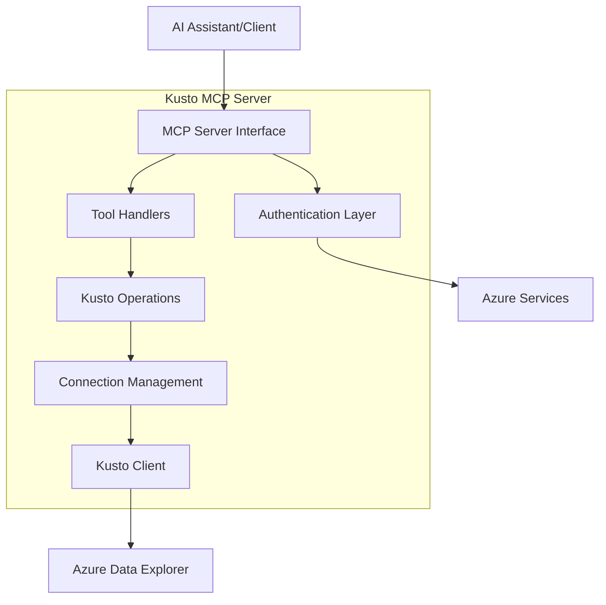
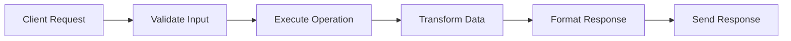
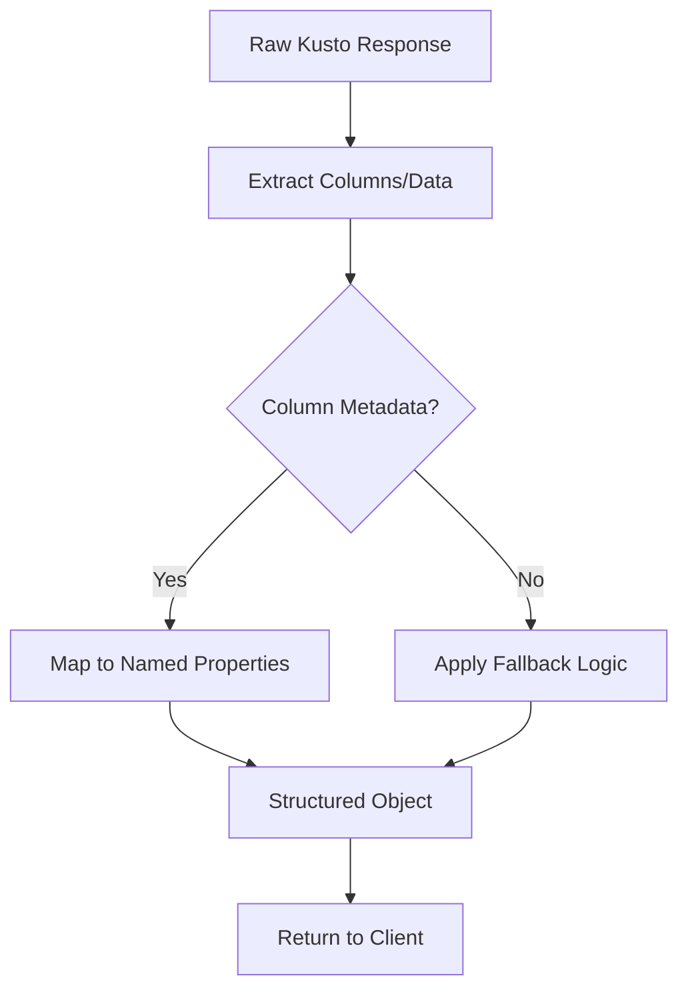
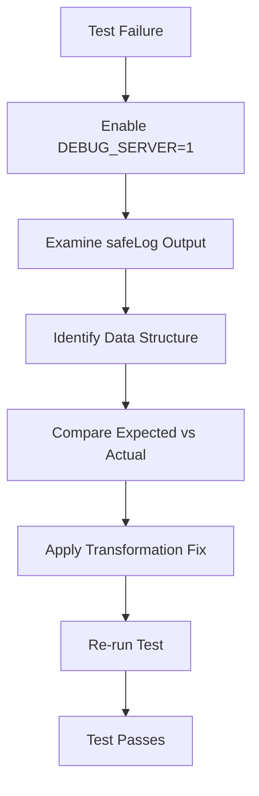
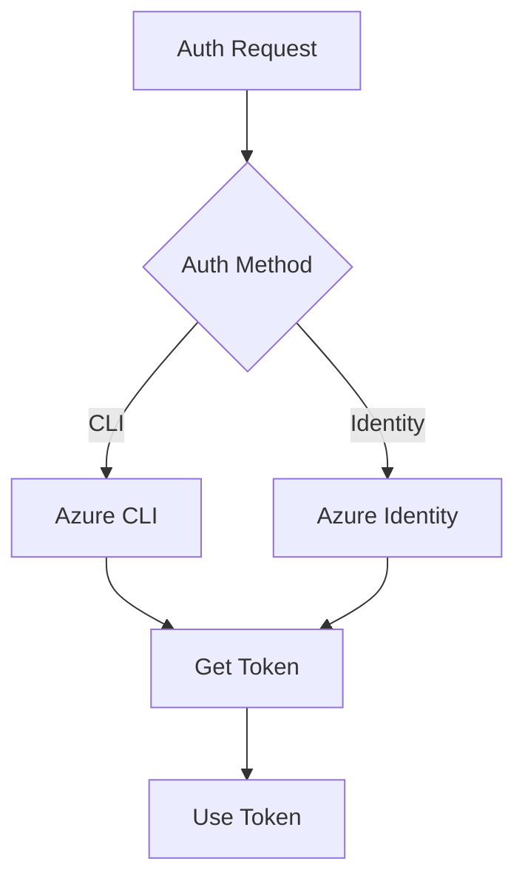
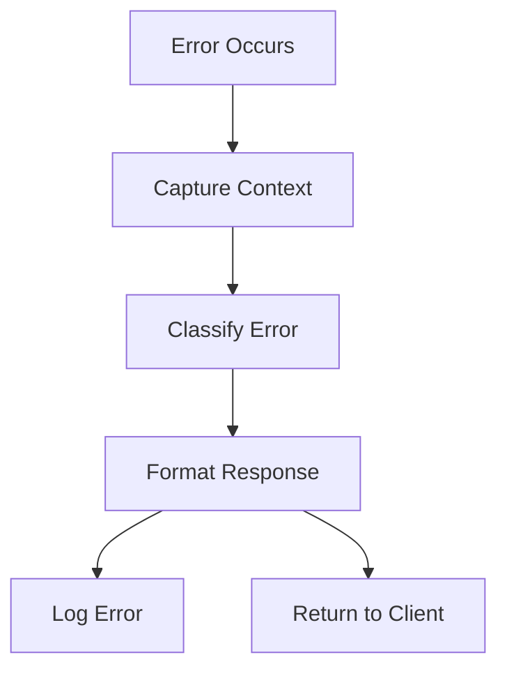
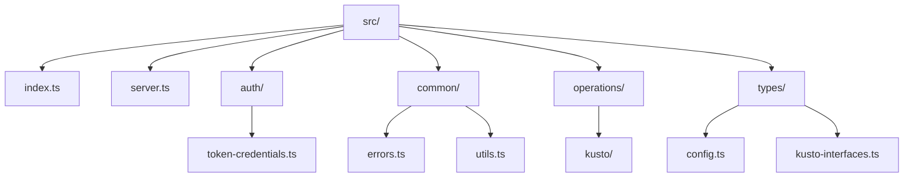
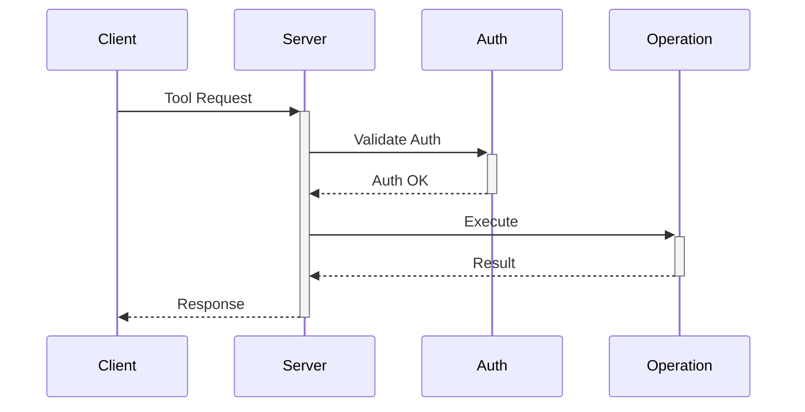
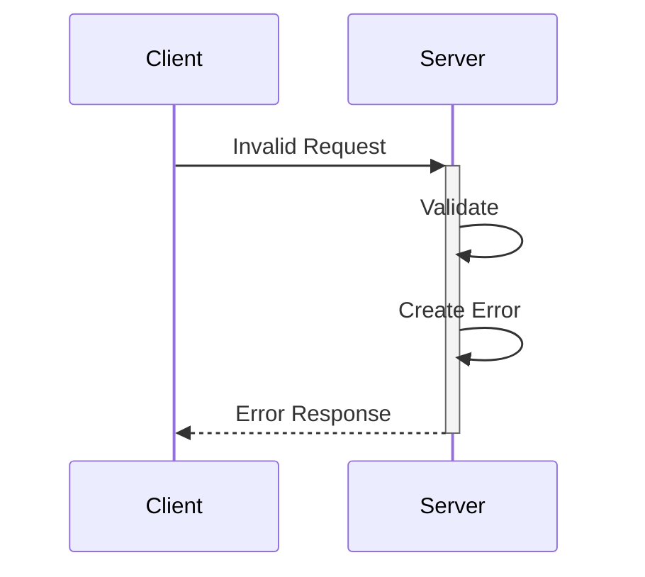

# Kusto MCP Server System Patterns

## System Architecture

## Core Components

### 1. MCP Server Interface

- Implements Model Context Protocol standards
- Handles client requests and responses
- Manages tool registration and execution
- Provides structured error responses

### 2. Authentication Layer

- Supports Azure CLI and Azure Identity methods
- Manages token acquisition and renewal
- Handles authentication state
- Provides secure credential management

### 3. Tool Handlers

- initialize-connection: Cluster connection setup
- show-tables: Database table listing
- show-table: Schema retrieval
- execute-query: Query execution
- Validates input parameters
- Returns structured responses

### 4. Kusto Operations

- Connection management
- Query execution
- Schema retrieval
- Error handling
- Performance optimization

## Design Patterns

### 1. Server Pattern

### 2. Data Transformation Pattern

### 3. Test Debugging Pattern

### 2. Authentication Pattern

### 3. Error Handling Pattern

## Technical Decisions

### 1. TypeScript Usage

- Strong type checking
- Interface definitions
- Code organization
- Development efficiency

### 2. Dependency Choices

- @azure/identity: Azure authentication
- azure-kusto-data: Kusto operations
- @opentelemetry: Monitoring
- zod: Schema validation

### 3. Project Structure

## Communication Patterns

### 1. Request Flow

### 2. Error Flow

## Performance Patterns

### 2. Query Optimization

- Parameter validation
- Query structure validation
- Result size management
- Timeout handling

## Security Patterns

### 1. Authentication Flow

- Token-based authentication
- Secure credential handling
- Token refresh management
- Error isolation

### 2. Authorization

- Azure role validation
- Operation-level checks
- Resource access control
- Error handling
