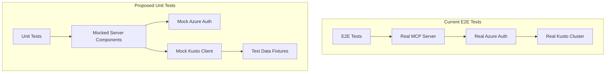
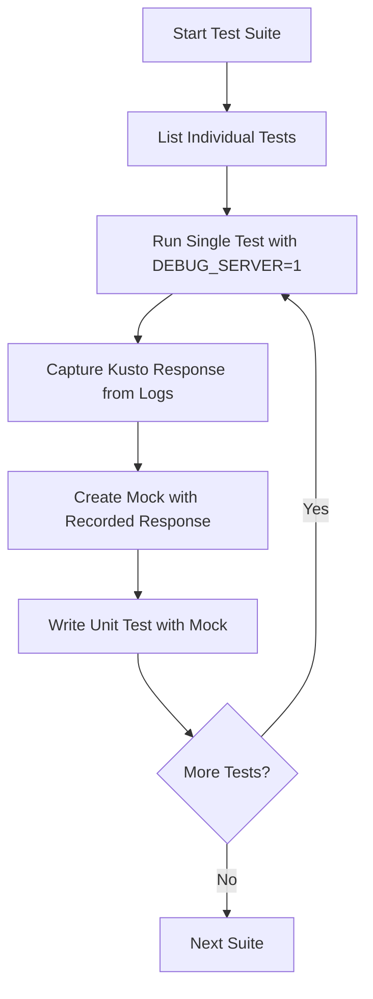

# Unit Tests Implementation - Product Requirements Document

## Executive Summary

This PRD outlines the implementation plan for converting the existing End-to-End (E2E) tests to Unit Tests with mocked Kusto client dependencies. The goal is to create fast, reliable unit tests that validate the same functionality as the current E2E tests while eliminating dependencies on real Azure Data Explorer clusters.

## Project Background

### Current State

- **Existing E2E Tests**: 5 test suites testing against real Kusto cluster (`https://help.kusto.windows.net/`)
- **Test Coverage**: Connection management, table operations, query execution, function operations, and error scenarios
- **Dependencies**: Real Azure authentication, live Kusto cluster, network connectivity
- **Execution Time**: ~2+ minutes per full test run
- **Reliability Issues**: Network dependencies, external service availability

### Target State

- **Unit Tests**: Fast, isolated tests with mocked dependencies
- **Execution Time**: <30 seconds for complete test suite
- **Reliability**: 100% deterministic, no external dependencies
- **Coverage**: Same functionality coverage as E2E tests
- **Development Experience**: Fast feedback loop for developers

## Current Test Infrastructure Analysis

### E2E Test Structure

```
tests/e2e/
├── config.ts                  # Test configuration
├── setup.ts                   # Global test setup
├── README.md                  # Documentation
├── helpers/
│   ├── mcp-test-client.ts     # MCP protocol client
│   ├── server-manager.ts      # Server process management
│   └── test-assertions.ts     # Custom test assertions
├── fixtures/
│   └── test-queries.kql       # Sample KQL queries
└── suites/
    ├── connection.test.ts     # Connection management tests
    ├── table-operations.test.ts # Table listing and schema tests
    ├── function-operations.test.ts # Function operations tests
    ├── query-execution.test.ts # Query execution tests
    ├── simple-server.test.ts  # Simple server tests
    └── error-scenarios.test.ts # Error handling tests
```

### Current Test Configuration

- **Jest Config**: `jest.config.cjs` with ESM support
- **TypeScript**: `tests/tsconfig.json` extending main project config
- **Setup**: E2E specific setup in `tests/e2e/setup.ts`
- **Timeout**: 120 seconds for E2E tests
- **Execution**: Sequential to avoid conflicts

### Key Components to Mock

1. **Azure Kusto Client** (`azure-kusto-data` library)
2. **Azure Authentication** (`@azure/identity`)
3. **Connection Management** (KustoConnection class)
4. **Query Execution** (executeQuery operations)

## Proposed Unit Test Architecture

### High-Level Architecture



### Proposed Directory Structure

```
tests/unit/
├── setup.ts                           # Jest setup with mocks
├── tsconfig.json                       # Unit test TypeScript config
├── fixtures/
│   ├── connection-responses.ts         # From connection.test.ts recordings
│   ├── table-operation-responses.ts    # From table-operations.test.ts recordings  
│   ├── query-execution-responses.ts    # From query-execution.test.ts recordings
│   ├── function-operation-responses.ts # From function-operations.test.ts recordings
│   ├── simple-server-responses.ts      # From simple-server.test.ts recordings
│   └── error-responses.ts              # From error-scenarios.test.ts recordings
├── mocks/
│   ├── kusto-client.ts                 # Mock azure-kusto-data
│   └── azure-identity.ts               # Mock @azure/identity
└── suites/
    ├── connection.test.ts              # Unit tests for connection
    ├── table-operations.test.ts        # Unit tests for table operations
    ├── query-execution.test.ts         # Unit tests for query execution  
    ├── function-operations.test.ts     # Unit tests for function operations
    ├── simple-server.test.ts           # Unit tests for simple server
    └── error-scenarios.test.ts         # Unit tests for error scenarios
```

## Implementation Workflow

### Recording-Based Mock Strategy

The implementation follows a methodical workflow to ensure accuracy:



### Per-Test Execution Process

1. **Run Individual E2E Test**: `DEBUG_SERVER=1 npx jest tests/e2e/suites/[suite].test.ts -t "[test-name]"`
2. **Capture Kusto Responses**: Extract from debug logs showing actual Kusto client responses
3. **Create Mock Fixtures**: Record exact response data in fixture files
4. **Implement Unit Test**: Write corresponding unit test with mocked responses
5. **Validate**: Ensure unit test passes and matches E2E behavior

### Configuration Updates

#### Jest Multi-Project Configuration

```javascript
// jest.config.cjs (updated)
module.exports = {
  projects: [
    {
      displayName: 'unit',
      roots: ['<rootDir>/tests/unit'],
      testMatch: ['**/tests/unit/**/*.test.ts'],
      setupFilesAfterEnv: ['<rootDir>/tests/unit/setup.ts'],
      testTimeout: 30000
    },
    {
      displayName: 'e2e',
      roots: ['<rootDir>/tests/e2e'],
      testMatch: ['**/tests/e2e/**/*.test.ts'],
      setupFilesAfterEnv: ['<rootDir>/tests/e2e/setup.ts'],
      testTimeout: 120000
    }
  ]
};
```

#### Package.json Scripts

```json
{
  "scripts": {
    "test:unit": "jest --selectProjects unit",
    "test:unit:watch": "jest --selectProjects unit --watch", 
    "test:unit:coverage": "jest --selectProjects unit --coverage",
    "test:e2e": "jest --selectProjects e2e",
    "test:e2e:debug": "DEBUG_SERVER=1 jest --selectProjects e2e",
    "test:all": "jest"
  }
}
```

## Task Breakdown

### Phase 1: Infrastructure Setup

**Task 1: Setup Unit Test Infrastructure**

- Create `tests/unit/` directory structure
- Create `tests/unit/setup.ts` with mock configurations
- Update `jest.config.cjs` for multi-project setup
- Create `tests/unit/tsconfig.json`
- Update `package.json` scripts for unit test commands
- Create base mock files for azure-kusto-data and @azure/identity

**Deliverables**: Complete unit test infrastructure ready for test implementation

### Phase 2: Connection Test Suite

**Task 2: Record and Mock Connection Tests**

- Run each test in `tests/e2e/suites/connection.test.ts` individually with DEBUG_SERVER=1
- Capture Kusto responses from debug logs
- Create `tests/unit/fixtures/connection-responses.ts` with recorded data
- Implement `tests/unit/suites/connection.test.ts` with mocked responses
- Verify unit tests pass and match E2E behavior

**Individual Tests to Process**:

1. "should initialize connection successfully"
2. "should handle invalid cluster URL"
3. "should handle invalid database name"
4. Any other connection tests

### Phase 3: Table Operations Test Suite

**Task 3: Record and Mock Table Operations Tests**

- Run each test in `tests/e2e/suites/table-operations.test.ts` individually
- Capture and mock table listing and schema responses
- Implement corresponding unit tests

**Individual Tests to Process**:

1. "should list tables in database"
2. "should get table schema"
3. "should handle non-existent table"
4. Any other table operation tests

### Phase 4: Query Execution Test Suite

**Task 4: Record and Mock Query Execution Tests**

- Process 12 individual query execution tests
- Capture complex query responses and result transformations
- Implement comprehensive query execution unit tests

**Individual Tests to Process**:

1. "should execute simple table query with take limit"
2. "should execute count query and return single row"
3. "should execute management command: .show tables"
4. "should execute aggregation query"
5. "should handle result limiting correctly"
6. "should detect partial results and set metadata correctly"
7. "should handle queries that return no results"
8. "should handle time-based queries with ago() function"
9. "should execute complex aggregation with grouping"
10. "should handle default limit when not specified"
11. "should handle schema exploration queries"
12. "should preserve column types in query results"

### Phase 5: Function Operations Test Suite

**Task 5: Record and Mock Function Operations Tests**

- Process function operation tests
- Capture function listing and detail responses
- Implement function operation unit tests

### Phase 6: Error Scenarios Test Suite

**Task 6: Record and Mock Error Scenarios Tests**

- Process error scenario tests
- Capture various error responses and edge cases
- Implement comprehensive error handling unit tests

### Phase 7: Simple Server Test Suite

**Task 7: Record and Mock Simple Server Tests**

- Process simple server tests
- Capture basic server operation responses
- Implement simple server unit tests

### Phase 8: Validation and Documentation

**Task 8: Final Validation and Documentation**

- Run complete unit test suite validation
- Performance comparison and documentation
- Update project documentation

## Technical Implementation Details

### Mock Strategy

#### Azure Kusto Client Mock

```typescript
// Mock the azure-kusto-data library
jest.mock('azure-kusto-data', () => ({
  Client: jest.fn().mockImplementation(() => ({
    execute: jest.fn()
  })),
  KustoConnectionStringBuilder: {
    withAzLoginIdentity: jest.fn()
  }
}));
```

#### Azure Identity Mock

```typescript
// Mock authentication to avoid real Azure calls
jest.mock('@azure/identity', () => ({
  AzureCliCredential: jest.fn(),
  DefaultAzureCredential: jest.fn()
}));
```

#### Test Data Fixtures Pattern

```typescript
// tests/unit/fixtures/connection-responses.ts
export const initializeConnectionResponse = {
  primaryResults: [/* actual recorded data from E2E */],
  tables: [/* actual recorded data from E2E */]
};
```

### Unit Test Pattern

```typescript
// tests/unit/suites/connection.test.ts
test('should initialize connection successfully', async () => {
  // Mock the Kusto client response
  mockExecuteQuery.mockResolvedValue(initializeConnectionResponse);
  
  // Test the actual logic
  const result = await handleInitializeConnection({
    cluster_url: 'https://test.kusto.windows.net',
    database: 'TestDB'
  });
  
  // Verify expected behavior
  expect(result.success).toBe(true);
  expect(mockExecuteQuery).toHaveBeenCalledWith(/* expected parameters */);
});
```

## Success Criteria

### Functional Requirements

1. **Complete Coverage**: All E2E test scenarios have corresponding unit tests
2. **Behavioral Equivalence**: Unit tests validate the same logic and edge cases
3. **Mock Accuracy**: Mocked responses match actual Kusto responses exactly
4. **Error Handling**: All error scenarios are covered with appropriate mocks

### Performance Requirements

1. **Execution Time**: Complete unit test suite runs in <30 seconds
2. **Individual Test Speed**: Each unit test completes in <1 second
3. **Parallel Execution**: Unit tests can run concurrently without conflicts

### Quality Requirements

1. **Reliability**: 100% deterministic test results
2. **Maintainability**: Clear fixture organization and mock structure
3. **Documentation**: Comprehensive documentation for unit test usage
4. **Integration**: Seamless integration with existing development workflow

## Benefits and Value Proposition

### Developer Experience

- **Fast Feedback**: Immediate test results for development
- **Reliable Testing**: No network dependencies or external service issues
- **Debug Friendly**: Easy to debug specific business logic without external complexity
- **Comprehensive Coverage**: Test edge cases and error scenarios easily

### CI/CD Pipeline

- **Fast Builds**: Reduced CI execution time
- **Reliable Builds**: No flaky tests due to network issues
- **Parallel Testing**: Can run multiple test jobs simultaneously
- **Cost Effective**: No external service dependencies in CI

### Maintenance

- **Predictable**: Test behavior is completely controlled
- **Isolated**: Changes to external services don't break tests
- **Focused**: Tests validate business logic, not integration points
- **Scalable**: Easy to add new test scenarios

## Risk Mitigation

### Mock Data Accuracy

- **Risk**: Mocked responses don't match real Kusto responses
- **Mitigation**: Record actual responses from working E2E tests

### Coverage Gaps

- **Risk**: Unit tests miss edge cases covered by E2E tests
- **Mitigation**: Systematic conversion of each E2E test to unit test

### Maintenance Overhead

- **Risk**: Mock data becomes outdated when Kusto responses change
- **Mitigation**: Preserve E2E tests for integration validation and regression testing

## Execution Timeline

### Task Order and Dependencies

1. **Task 1** (Infrastructure) - Foundation for all other tasks
2. **Task 2** (Connection) - Required by all other functional tests
3. **Tasks 3-7** (Test Suites) - Can be executed in parallel after Task 2
4. **Task 8** (Validation) - Final validation and documentation

### Estimated Effort

- **Task 1**: 1 conversation (Infrastructure setup)
- **Task 2**: 1 conversation (Connection tests - foundational)
- **Task 3**: 1 conversation (Table operations)
- **Task 4**: 2 conversations (Query execution - most complex)
- **Task 5**: 1 conversation (Function operations)
- **Task 6**: 1 conversation (Error scenarios)
- **Task 7**: 1 conversation (Simple server)
- **Task 8**: 1 conversation (Validation and documentation)

**Total**: 9 conversations

## Conclusion

This unit test implementation project will significantly improve the development experience and reliability of the Kusto MCP Server testing suite. By following the systematic recording-based approach, we ensure accuracy while gaining the benefits of fast, reliable unit tests. The preservation of E2E tests maintains integration confidence while unit tests provide rapid feedback for development.

The multi-phase approach allows for incremental progress and validation, ensuring each component is thoroughly tested before moving to the next. The result will be a comprehensive, maintainable, and fast-executing test suite that supports confident development and deployment of the Kusto MCP Server.
